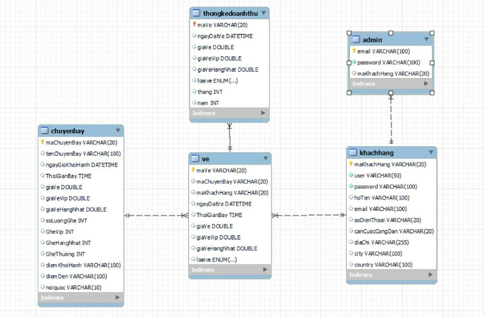

<h1 align="center">✈️ ỨNG DỤNG ĐẶT VÉ MÁY BAY</h1>

<p align="center">
  
  
  
</p>

<p align="center">
  
</p>

<p align="center"><strong>Hệ thống đặt vé máy bay hiện đại – chính xác – tiện lợi</strong></p>

---

## 📘 Giới thiệu

Đây là ứng dụng quản lý đặt vé máy bay được xây dựng bằng **Java Spring Boot** với giao diện người dùng sử dụng **Thymeleaf**, tích hợp CSDL **MySQL Cloud (Aiven)**, và thiết kế theo mô hình **MVC 3 lớp**. Ứng dụng hỗ trợ quản lý thông tin khách hàng, chuyến bay, vé máy bay và thống kê doanh thu theo tháng/năm, phù hợp triển khai trong các cơ sở đào tạo, phòng vé nhỏ hoặc mục đích học tập.

---

## 🎯 Mục tiêu dự án

- Quản lý hiệu quả thông tin khách hàng, vé, chuyến bay và doanh thu.
- Thiết kế kiến trúc hệ thống rõ ràng (MVC), dễ bảo trì và mở rộng.
- Thực hiện đầy đủ chức năng **CRUD**, validate dữ liệu người dùng.
- Áp dụng kiểm thử tự động với **JUnit**, tích hợp cloud database nếu cần.
- Có thể mở rộng lên RESTful API hoặc tích hợp thanh toán thực tế.

---

## ⚙️ Chức năng chính

### 🧑‍💼 Quản lý Khách hàng

- Thêm, sửa, xoá, tìm kiếm khách hàng.
- Kiểm tra định dạng email, số điện thoại, CCCD.
- Liên kết vé với mã khách hàng.

### ✈️ Quản lý Chuyến bay

- Thêm, sửa, xoá, tìm kiếm chuyến bay.
- Kiểm tra định dạng mã chuyến bay (VD: VN123).
- Tự động cập nhật số ghế còn trống.

### 🎫 Quản lý Vé máy bay

- Đặt, sửa, huỷ vé cho từng hành khách.
- Mã vé theo định dạng chuẩn `^[A-Z]{2}\\d{5}$`.
- Liên kết vé với khách hàng & chuyến bay.

### 📈 Thống kê Doanh thu

- Thống kê theo tháng/năm, phân loại theo loại vé.
- Hiển thị dữ liệu rõ ràng bằng bảng hoặc biểu đồ.

---

## 💻 Công nghệ sử dụng

| Thành phần         | Công nghệ triển khai           |
| ------------------ | ------------------------------ |
| Ngôn ngữ           | Java 17                        |
| Backend Framework  | Spring Boot 3.3.1 + Spring MVC |
| Giao diện frontend | Thymeleaf + Bootstrap          |
| ORM                | Hibernate + Spring Data JPA    |
| Cơ sở dữ liệu      | MySQL Cloud (Aiven)            |
| Kiểm thử           | JUnit 5, Mockito               |
| Build tool         | Maven                          |
| Quản lý mã nguồn   | Git + GitHub                   |

---

## 🧠 Kiến trúc & Thiết kế

- Áp dụng mô hình **MVC 3 lớp**:

  - **Controller**: xử lý request từ người dùng.
  - **Service**: xử lý logic nghiệp vụ.
  - **Repository**: giao tiếp với CSDL qua Spring Data JPA.

- Mẫu thiết kế áp dụng:

  - `Singleton` cho quản lý kết nối.
  - `Builder Pattern` cho khởi tạo vé, khách hàng.

- Chuẩn bị sẵn cho việc nâng cấp: REST API, phân quyền với Spring Security.

---

## 🧪 Kiểm thử

- Dùng `JUnit 5` để kiểm thử lớp Service.
- Dùng `Mockito` để mô phỏng Repository trong test.
- Xử lý lỗi an toàn với `try-catch-finally`.
- Các đầu vào đều được validate trước khi lưu CSDL.

---

## 🚀 Hướng dẫn triển khai

### 🔹 Bước 1: Chuẩn bị môi trường

- Cài đặt **Java JDK 17** trở lên.
- Cài đặt **IntelliJ IDEA** hoặc **Eclipse**.
- Có tài khoản Aiven (hoặc sử dụng file config CSDL cloud có sẵn).
- Cài Git nếu muốn clone từ GitHub.

---

### 🔹 Bước 2: Tải mã nguồn dự án

```bash
git clone https://github.com/zatalav/OOP_N03_Term3_2025_K17_Group1.git
```

Hoặc giải nén file `.zip` nếu tải từ LMS/Drive.

---

### 🔹 Bước 3: Mở dự án vào IDE

- Mở IntelliJ IDEA → `File > Open` → chọn thư mục dự án
- IDE sẽ tự tải các thư viện từ `pom.xml`

---

### 🔹 Bước 4: Cấu hình kết nối cơ sở dữ liệu

Mở file:

```
src/main/resources/application.properties
```

Cấu hình kết nối tới Aiven:

```properties
spring.datasource.url=jdbc:mysql://mysql-144ff22b-st-cdf0.c.aivencloud.com:24071/defaultdb?ssl-mode=REQUIRED
spring.datasource.username=avnadmin
spring.datasource.password=AVNS_exSUp-vLmtG417vPPN7
spring.jpa.hibernate.ddl-auto=update
spring.jpa.show-sql=true
spring.thymeleaf.cache=false
```

📝 Ghi chú:

- Không cần tạo database thủ công nếu dùng `defaultdb` của Aiven.
- Đảm bảo port `24071` không bị firewall chặn.

---

### 🔹 Bước 5: Khởi chạy ứng dụng

Mở file:

```
src/main/java/com/example/veapp/VeAppApplication.java
```

Click **Run** hoặc chạy bằng:

```bash
mvn spring-boot:run
```

---

### 🔹 Bước 6: Truy cập hệ thống

Mở trình duyệt tại:

```
https://v1sj6z0r-8080.asse.devtunnels.ms/
```

| Đường dẫn        | Chức năng             |
| ---------------- | --------------------- |
| `/KhachHang`     | Quản lý khách hàng    |
| `/ChuyenBay`     | Quản lý chuyến bay    |
| `/Ve`            | Quản lý vé máy bay    |
| `/ThongKe`       | Thống kê doanh thu    |
| `/` hoặc `/home` | Trang chủ – chào mừng |

---

## 📂 Cấu trúc thư mục dự án

```
springBoot-main/
├── controller/             # Các Controller (KhachHang, Ve, ChuyenBay,...)
├── service/                # Business logic
├── repository/             # Tầng giao tiếp CSDL
├── model/                  # Các Entity (Ve, ChuyenBay, KhachHang)
├── templates/              # Giao diện Thymeleaf
├── static/                 # CSS, JS, hình ảnh
├── VeAppApplication.java   # Class khởi chạy ứng dụng
├── application.properties  # File cấu hình CSDL
└── README.md               # Mô tả dự án
```

---

## 📷 Giao diện & Biểu đồ

- Giao diện hiện đại với Thymeleaf + Bootstrap
- Các biểu đồ đã hoàn thành:

  ✅ UML Class Diagram  
  ✅ Activity Diagram (Thêm/Sửa/Xoá)  
  ✅ Sequence Diagram  
  ✅ ERD (Quan hệ giữa các bảng)  
  ✅ Flowchart xử lý chức năng chính

📁 Xem trong thư mục `img/` hoặc file báo cáo `.docx`.

---

## 👨‍💻 Nhóm thực hiện

| MSSV     | Họ và Tên                 | Vai trò chi tiết                                                          |
| -------- | ------------------------- | ------------------------------------------------------------------------- |
| 23010772 | **Lê Đức Duy**            | Phụ trách chức năng quản lý **Vé**, thiết kế giao diện chính, viết README |
| 23010123 | **Lê Mạnh Hùng**          | Xây dựng chức năng **Chuyến bay**, xử lý logic và giao diện liên quan     |
| 23016112 | **Nguyễn Thị Khánh Linh** | Triển khai chức năng **Khách hàng**, kiểm thử, validate dữ liệu đầu vào   |

📍 Trường: **Đại học Phenikaa**  
📫 GitHub nhóm: [https://github.com/zatalav/OOP_N03_Term3_2025_K17_Group1](https://github.com/zatalav/OOP_N03_Term3_2025_K17_Group1)

---

## 📸 Hình ảnh hệ thống

| Giao diện & Biểu đồ                                                                              |
| ------------------------------------------------------------------------------------------------ |
|                                                              |
| Sơ đồ lớp UML                                                                                    |
|                                                 |
| Sơ đồ Activity đăng nhập                                                                         |
|                                       |
| Sơ đồ Activity thêm chuyến bay                                                                   |
|                                         |
| Sơ đồ Activity sửa chuyến bay                                                                    |
|                                         |
| Sơ đồ Activity xóa chuyến bay                                                                    |
|                                |
| Sơ đồ Activity tìm kiếm chuyến bay                                                               |
|                                         |
| Sơ đồ Activity thêm khách hàng                                                                   |
|                                           |
| Sơ đồ Activity sửa khách hàng                                                                    |
|                                           |
| Sơ đồ Activity xóa khách hàng                                                                    |
|                                  |
| Sơ đồ Activity tìm kiếm khách hàng                                                               |
|                                                 |
| Sơ đồ Activity thêm vé                                                                           |
|                                                   |
| Sơ đồ Activity sửa vé                                                                            |
|                                                   |
| Sơ đồ Activity xóa vé                                                                            |
|                                          |
| Sơ đồ Activity tìm kiếm vé                                                                       |
|                                           |
| Biểu đồ ca sử dụng tổng quát                                                                     |
|                                |
| Biểu đồ use-case quản lý chuyến bay                                                              |
|                                |
| Biểu đồ use-case quản lý khách hàng                                                              |
|                                        |
| Biểu đồ use-case quản lý vé                                                                      |
|                                |
| Biểu đồ use-case thống kê doanh thu                                                              |
|                                  |
| Biểu đồ tuần tự chức năng đăng nhập                                                              |
|                        |
| Biểu đồ tuần tự chức năng thêm chuyến bay                                                        |
|                          |
| Biểu đồ tuần tự chức năng sửa chuyến bay                                                         |
|                          |
| Biểu đồ tuần tự chức năng xóa chuyến bay                                                         |
|                 |
| Biểu đồ tuần tự chức năng tìm kiếm chuyến bay                                                    |
|                        |
| Biểu đồ tuần tự chức năng thêm khách hàng                                                        |
|                          |
| Biểu đồ tuần tự chức năng sửa khách hàng                                                         |
|                          |
| Biểu đồ tuần tự chức năng xóa khách hàng                                                         |
|                 |
| Biểu đồ tuần tự chức năng tìm kiếm khách hàng                                                    |
|                                |
| Biểu đồ tuần tự chức năng thêm vé                                                                |
|  |
| Try-catch-finally                                                                                |
|            |
| UI quản lý vé                                                                                    |

## 🗂️ Sơ đồ cơ sở dữ liệu (ERD)

### 1. 🔹 Sơ đồ hệ thống cơ bản

Hệ thống đặt vé máy bay được xây dựng với các bảng chính như:

- `chuyenbay`: lưu thông tin các chuyến bay
- `khachhang`: lưu thông tin người dùng
- `ve`: lưu thông tin các vé đã đặt
- `account`: lưu thông tin tài khoản đăng nhập người dùng


Sơ đồ này mô tả mối quan hệ:

- Một khách hàng có thể đặt nhiều vé (`1 - n`)
- Một chuyến bay có thể có nhiều vé (`1 - n`)
- Bảng `account` có quan hệ 1-1 với bảng `khachhang` để phân quyền người dùng

---

### 2. 🔸 Sơ đồ hệ thống mở rộng

Sau quá trình phát triển, hệ thống được mở rộng thêm:

- `admin`: bảng quản trị viên có quyền quản lý hệ thống
- `thongkedoanhthu`: bảng dùng cho thống kê doanh thu theo tháng, năm, loại vé



Các mối quan hệ mới:

- `admin` liên kết đến `khachhang` để xác định người dùng có quyền quản trị
- `thongkedoanhthu` liên kết với `ve` để tổng hợp doanh thu theo từng loại vé và thời điểm

---

🔎 **Lý do sử dụng 2 sơ đồ:**

- Sơ đồ đầu tiên giúp xây dựng hệ thống cơ bản, phục vụ chức năng đặt vé và quản lý khách hàng.
- Sơ đồ thứ hai mở rộng hệ thống theo hướng có thể **báo cáo, thống kê**, và **phân quyền truy cập** rõ ràng hơn.

## 📚 License

Dự án được phát triển cho mục tiêu học tập tại Đại học Phenikaa. Không sử dụng thương mại nếu không có sự cho phép.

## ✅ Kết luận

- ✅ Hoàn thiện đầy đủ chức năng: CRUD, kiểm thử, thống kê, validate
- ✅ Thiết kế theo mô hình chuẩn MVC, phân lớp rõ ràng
- ✅ Giao diện thân thiện, có thể demo thực tế qua DevTunnel
- ✅ Sẵn sàng mở rộng REST API, phân quyền, cloud storage, tích hợp thanh toán
